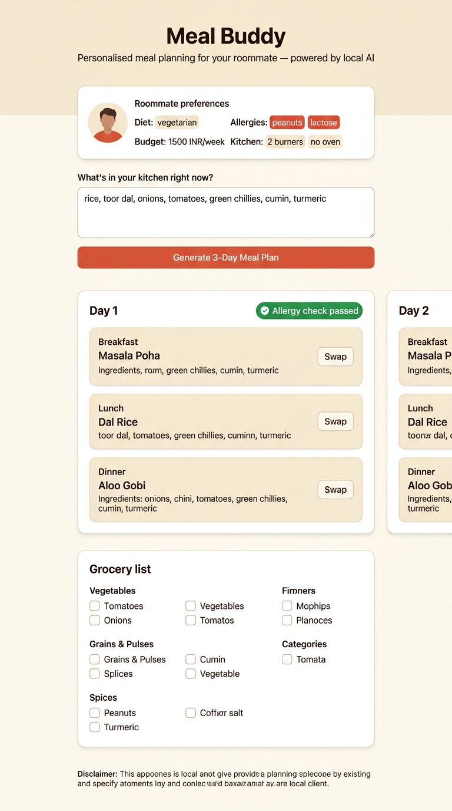

# 🍛 Meal Buddy

**A local AI meal planner built for one specific person — my roommate.**

Built for the [DEV Hacktoberfest Weekend Challenge: "Build for a Friend"](https://dev.to/challenges/hacktoberfest-weekend-2026-10-01).

Meal Buddy uses **Gemma** (open-weight model) via **Ollama** — everything runs
on your laptop, offline, with zero paid APIs.



---

## Why open-source AI?

My roommate's allergies and food preferences are personal health data. With
Gemma running locally through Ollama, **none of that ever leaves the laptop** —
no cloud, no API keys, no accounts, no cost. It works fully offline (great for
hostel Wi-Fi), and if you want a different model you swap one line of config.
Open-weight means anyone can audit exactly what's running.

---

## What it does

- 📋 Stores your profile (allergies, diet, budget, kitchen setup) in an editable JSON file
- 🧅 Takes free-text pantry input ("rice, dal, onions, tomatoes…")
- 🤖 Generates a **3-day meal plan** using Gemma, prioritising pantry ingredients
- 🛡️ **Hard allergy safety**: double-checks every plan with a second AI pass + keyword scan — regenerates if unsafe
- 🛒 Outputs a **grocery list** (only missing items), grouped by category, with cost estimates
- 🔄 **"Swap this meal"** button to regenerate any single meal without touching the rest
- ⚠️ Clear disclaimer: this is a helper, not medical advice

## What my roommate said

> *"I mass cooked dal for three days last week because I couldn't think of
> anything else. This actually gave me ideas I'd eat."*

"Meal Buddy completely changed how I cook with what's already in my kitchen!"-Uma

## Tech stack

| Layer     | Tech                         |
|-----------|------------------------------|
| AI model  | Gemma 3 via Ollama (local)   |
| Backend   | Python + FastAPI             |
| Frontend  | Vanilla HTML/CSS/JS          |
| Data      | One JSON file (profile.json) |

## Setup (5 minutes)

### 1. Install Ollama

Download from [ollama.com](https://ollama.com) and install it.

### 2. Pull the model

```bash
ollama pull gemma3
```

> **To use a different model**, pull it (`ollama pull mistral`) and change
> `MODEL_NAME` at the top of `app.py`.

### 3. Install Python dependencies

```bash
cd meal-buddy
pip install -r requirements.txt
```

### 4. Edit the profile

Copy the example and fill in your friend's real details:

```bash
cp profile.example.json profile.json   # Linux/macOS
copy profile.example.json profile.json  # Windows
```

Then edit `profile.json` with their actual allergies, diet, budget, etc.
The real `profile.json` is gitignored — it never gets committed.

> On first run, `app.py` will auto-copy `profile.example.json` → `profile.json`
> if you skip this step, so it works out of the box with sample data.

### 5. Run the app

```bash
python app.py
```

Open **http://127.0.0.1:8000** in your browser.

## Swapping the AI model

Open `app.py` and change `MODEL_NAME` at the top:

```python
MODEL_NAME = "gemma3"       # ← change this
```

Options (run `ollama pull <name>` first):
- `gemma3` — default, good balance
- `gemma3:4b` — smaller/faster variant
- `mistral` — good alternative
- `llama3.2` — another solid choice

## Test inputs

### Test 1 — Basic pantry
```
rice, toor dal, onions, tomatoes, green chillies, cumin, turmeric, mustard seeds, curry leaves, coconut
```

### Test 2 — Minimal pantry (forces bigger grocery list)
```
rice, salt, oil
```

### Test 3 — Well-stocked pantry
```
rice, wheat flour (atta), toor dal, moong dal, potatoes, onions, tomatoes,
green chillies, ginger, garlic, cumin, turmeric, red chilli powder,
coriander powder, mustard seeds, curry leaves, coconut, tamarind,
jaggery, semolina (rava), poha (flattened rice), oil, salt
```

## Project structure

```
meal-buddy/
├── app.py                  # FastAPI backend + Ollama integration
├── profile.example.json    # Sample profile (committed to repo)
├── profile.json            # Your real profile (gitignored)
├── requirements.txt        # Python dependencies
├── screenshot.jpg          # App screenshot
├── .gitignore              # Keeps profile.json + __pycache__ out of git
├── README.md               # This file
└── templates/
    └── index.html          # Single-page frontend
```

## ⚠️ Disclaimer

Meal Buddy is a helper tool, **not** medical or nutritional advice. Always
double-check ingredients if you have severe allergies.

---

*Built with ❤️ for my roommate · Hacktoberfest 2026*
